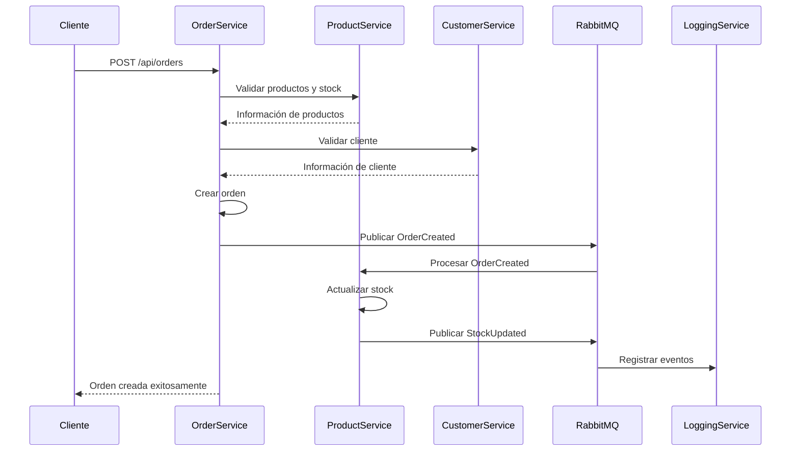

# Order Management System 🚀

Un sistema completo de gestión de pedidos dockerizado, construido con .NET 8 y React + TypeScript.

# Order Management System 🚀

Un sistema completo de gestión de pedidos dockerizado, construido con .NET 8 y React + TypeScript.

## ⚡ Inicio Rápido

### 🐳 Con Docker (Recomendado para Demo)
**¡Ejecuta todo el sistema con un solo comando!**

```bash
bash start-oms.sh
```

### 🏠 Desarrollo Local (Recomendado para Desarrollo)
**¡Desarrollo rápido con hot reload!**

```bash
bash start-local.sh
```

### 🔗 URLs del Sistema

| Servicio | Docker | Local | Swagger |
|----------|--------|-------|---------|
| **Frontend** | http://localhost:3000 | http://localhost:3000 | - |
| **Order Service** | http://localhost:5001 | http://localhost:5001 | /swagger |
| **Product Service** | http://localhost:5002 | http://localhost:5002 | /swagger |
| **Customer Service** | http://localhost:5003 | http://localhost:5003 | /swagger |
| **Logging Service** | http://localhost:5004 | http://localhost:5004 | /swagger |
| **RabbitMQ Management** | http://localhost:15672 | http://localhost:15672 | guest/guest |

## 🏗️ Arquitectura de Microservicios

```
┌─────────────────────────────────────────────────────────────────┐
│                      CLIENTE/APLICACIÓN                         │
│                    (HTTP/HTTPS + JWT)                          │
└─────────────────┬───────────────────────────────────────────────┘
                  │ HTTP + JWT
                  ▼
┌─────────────────────────────────────────────────────────────────┐
│                    API GATEWAY (Opcional)                      │
└─────────────────┬───────────────────────────────────────────────┘
                  │
    ┌─────────────┼─────────────┬─────────────┬─────────────┐
    │             │             │             │             │
    ▼             ▼             ▼             ▼             ▼
┌─────────┐  ┌─────────┐  ┌─────────┐  ┌─────────┐  ┌─────────┐
│ Order   │  │Product  │  │Customer │  │Logging  │  │ Auth    │
│Service  │  │Service  │  │Service  │  │Service  │  │Service  │
│:5001    │  │:5002    │  │:5003    │  │:5004    │  │:5005    │
└─────┬───┘  └─────┬───┘  └─────┬───┘  └─────┬───┘  └─────────┘
      │            │            │            │
      └────────────┼────────────┼────────────┘
                   │            │
                   ▼            ▼
              ┌─────────────────────┐
              │     RabbitMQ        │
              │   Message Broker    │
              │   :5672 | :15672    │
              └─────────────────────┘
                       │
                       ▼
              ┌─────────────────────┐
              │    SQL Server       │
              │  Multiple Databases │
              │      :1433          │
              └─────────────────────┘
```

## � Guías de Inicio

### 🐳 [Docker Deployment](DOCKER_DEPLOYMENT.md)
**Para demos, testing y producción**
- Un solo comando para iniciar todo
- Aislamiento completo de dependencias
- Configuración de producción lista

### 🏠 [Local Development](LOCAL_DEVELOPMENT.md)  
**Para desarrollo activo y debugging**
- Hot reload para desarrollo rápido
- Debugging completo de .NET y React
- Menor uso de recursos del sistema

### ⚡ Comandos Rápidos

```bash
# 🐳 Docker: Todo el stack completo
bash start-oms.sh                 # Iniciar con Docker
bash test-integration.sh          # Probar el sistema

# 🏠 Local: Desarrollo rápido  
bash start-local.sh               # Iniciar localmente
bash check-local.sh               # Verificar servicios
bash stop-local.sh                # Detener servicios

# 📊 Verificación de estado
bash check-local.sh --quick       # Verificación rápida
docker ps                         # Ver contenedores Docker
```

## �📋 Características del Sistema

### 🔧 Backend (Microservicios .NET 8)
- **OrderService**: Gestión de órdenes y transacciones
- **ProductService**: Catálogo de productos e inventario
- **CustomerService**: Gestión de clientes y autenticación
- **LoggingService**: Centralización de logs y auditoría

### 🛠️ Tecnologías Principales

#### Backend
- **.NET 8** - Framework principal
- **Entity Framework Core** - ORM
- **SQL Server** - Base de datos
- **RabbitMQ** - Message broker
- **Serilog** - Logging estructurado
- **xUnit** - Testing unitario
- **Docker** - Containerización
- Docker Desktop (opcional)

### Opción 1: Configuración Manual

#### 1. Configurar Backend
```bash
# Clonar repositorio
git clone <repository-url>
cd order-management-system/order-management-backend

# Configurar bases de datos
./infra/scripts/setup-databases.ps1

# Restaurar dependencias
dotnet restore

# Ejecutar migraciones (por cada servicio)
dotnet ef database update --project services/OrderService/src/Infrastructure

# Ejecutar servicios
dotnet run --project services/OrderService/src/Web --urls="https://localhost:5001"
dotnet run --project services/ProductService/src/Web --urls="https://localhost:5002"
dotnet run --project services/CustomerService/src/Web --urls="https://localhost:5003"
dotnet run --project services/LoggingService/src/Web --urls="https://localhost:5004"
```

### Opción 2: Docker Compose (TODO EL SISTEMA - UN SOLO COMANDO) 🚀

```bash
# NUEVO: Dockerización completa - Backend + Frontend + Infraestructura
# Un solo comando para levantar todo el sistema

# Windows (PowerShell) - RECOMENDADO
.\start-system.ps1

# Linux/Mac/WSL (Bash)
./start-system.sh

# O directamente con Docker Compose
docker-compose up -d

# Ver todo funcionando:
# Frontend: http://localhost:3000
# APIs: http://localhost:500X/swagger
# RabbitMQ: http://localhost:15672
```

**🎉 NUEVO: Sistema Completamente Dockerizado**
- ✅ Backend (4 microservicios)
- ✅ Frontend React
- ✅ SQL Server + RabbitMQ
- ✅ Un solo comando para todo
- ✅ Health checks automáticos
- ✅ Hot reload en desarrollo

Ver documentación completa: [DOCKER_README.md](DOCKER_README.md)

### Opción 3: Docker Compose Backend (Original)

```bash
# Solo backend (método original)
cd order-management-backend

# Ejecutar toda la infraestructura backend
docker-compose -f infra/docker/docker-compose.yml up -d

# Ver logs
docker-compose -f infra/docker/docker-compose.yml logs -f
```

## 📚 Documentación por Servicio

### 🔵 OrderService (Puerto 5001)
```
GET    /api/orders              # Listar órdenes
GET    /api/orders/{id}         # Obtener orden
POST   /api/orders              # Crear orden
PUT    /api/orders/{id}         # Actualizar orden
DELETE /api/orders/{id}         # Eliminar orden
GET    /api/orders/customer/{customerId} # Órdenes por cliente
```

### 🟢 ProductService (Puerto 5002)
```
GET    /api/products            # Listar productos
GET    /api/products/{id}       # Obtener producto
POST   /api/products            # Crear producto
PUT    /api/products/{id}       # Actualizar producto
PUT    /api/products/{id}/stock # Actualizar stock
```

### 🟡 CustomerService (Puerto 5003)
```
GET    /api/customers           # Listar clientes
GET    /api/customers/{id}      # Obtener cliente
POST   /api/customers           # Crear cliente
POST   /api/auth/login          # Autenticación
POST   /api/auth/register       # Registro
```

### 🟣 LoggingService (Puerto 5004)
```
GET    /api/logs                # Consultar logs
GET    /api/logs/search         # Búsqueda avanzada
POST   /api/logs                # Crear log
```

## 🔄 Flujo de Comunicación

### Flujo de Creación de Orden


## 🧪 Testing

### Backend
```bash
# Tests unitarios por servicio
dotnet test services/OrderService/tests/
dotnet test services/ProductService/tests/
dotnet test services/CustomerService/tests/
dotnet test services/LoggingService/tests/

# Tests de integración
dotnet test tests/Integration.Tests/

# Coverage report
dotnet test --collect:"XPlat Code Coverage"
```

## 📊 Monitoreo y Observabilidad

### Logs Centralizados
- **Serilog** en todos los servicios
- **Structured logging** con correlationId
- **LoggingService** para consultas centralizadas

### Métricas
- Health checks en `/health`
- Swagger UI en cada servicio
- RabbitMQ Management en `http://localhost:15672`

### URLs de Desarrollo
- **OrderService**: https://localhost:5001/swagger
- **ProductService**: https://localhost:5002/swagger
- **CustomerService**: https://localhost:5003/swagger
- **LoggingService**: https://localhost:5004/swagger
- **RabbitMQ Management**: http://localhost:15672

## 🔧 Configuración

### Variables de Entorno Backend
```env
# Base de datos
ConnectionStrings__DefaultConnection=Server=localhost;Database=OrderManagement_{Service};Trusted_Connection=true;

# RabbitMQ
RabbitMQ__HostName=localhost
RabbitMQ__UserName=guest
RabbitMQ__Password=guest

# JWT
Jwt__Key=your-secret-key
Jwt__Issuer=OrderManagementSystem
Jwt__Audience=OrderManagementSystem
```

## 🏗️ Patrones de Diseño Implementados

### Backend
- **Repository Pattern**: Abstracción de acceso a datos
- **Unit of Work**: Gestión de transacciones
- **CQRS**: Separación de comandos y consultas
- **Domain Events**: Comunicación entre contextos
- **Dependency Injection**: Inversión de control
- **Mediator Pattern**: Desacoplamiento de handlers
- **CQRS**: Separación de comandos y consultas
- **Dependency Injection**: Inversión de control
- **Event-Driven Architecture**: Comunicación asíncrona

## 📝 Convenciones de Código

### Backend (.NET)
- **PascalCase**: Clases, métodos, propiedades
- **camelCase**: Variables locales, parámetros
- **Interfaces**: Prefijo `I`
- **Servicios**: Sufijo `Service`
- **Repositorios**: Sufijo `Repository`

## 🚀 Deployment

### Desarrollo Local
```bash
# Backend
dotnet run --project services/{ServiceName}/src/Web
```

### Producción con Docker
```bash
# Build y deploy completo
docker-compose -f infra/docker/docker-compose.yml up -d --build
```

### Azure Deployment
```bash
# Backend con Azure Container Apps
az containerapp up --name order-management --resource-group myRG
```

## 🤝 Contribución

1. Fork el proyecto
2. Crear feature branch (`git checkout -b feature/AmazingFeature`)
3. Commit cambios (`git commit -m 'Add some AmazingFeature'`)
4. Push a la branch (`git push origin feature/AmazingFeature`)
5. Abrir Pull Request

## 📄 Licencia

[MIT License](LICENSE)

## 👥 Equipo

- **Arquitectura**: Microservicios + Event-Driven
- **Backend**: .NET 8 + Entity Framework + RabbitMQ
- **Persistencia**: SQL Server por microservicio
- **Comunicación**: HTTP + Events asíncronos
- **Seguridad**: JWT + HTTPS + CORS