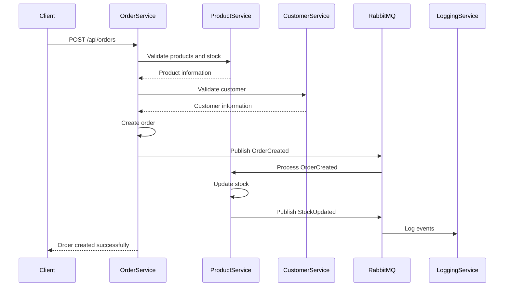

# Order Management System 🚀

A complete dockerized order management system built with .NET 8 and React + TypeScript.

## ⚡ Quick Start

### 🐳 Docker (Recommended for Demo)
**Run the entire system with a single command!**

```bash
bash scripts/docker/start-oms.sh
```

### 🏠 Local Development (Recommended for Development)
**Fast development with hot reload!**

```bash
bash scripts/local/start-local.sh
```

### 🔗 System URLs

| Service | Docker | Local | Swagger |
|---------|--------|-------|---------|
| **Frontend** | http://localhost:3000 | http://localhost:3000 | - |
| **Order Service** | http://localhost:5001 | http://localhost:5001 | /swagger |
| **Product Service** | http://localhost:5002 | http://localhost:5002 | /swagger |
| **Customer Service** | http://localhost:5003 | http://localhost:5003 | /swagger |
| **Logging Service** | http://localhost:5004 | http://localhost:5004 | /swagger |
| **RabbitMQ Management** | http://localhost:15672 | http://localhost:15672 | guest/guest |

## 🏗️ Microservices Architecture

```
┌─────────────────────────────────────────────────────────────────┐
│                    CLIENT/APPLICATION                           │
│                    (HTTP/HTTPS + JWT)                          │
└─────────────────┬───────────────────────────────────────────────┘
                  │ HTTP + JWT
                  ▼
┌─────────────────────────────────────────────────────────────────┐
│                   API GATEWAY (Optional)                       │
└─────────────────┬───────────────────────────────────────────────┘
                  │
    ┌─────────────┼─────────────┬─────────────┬─────────────┐
    │             │             │             │             │
    ▼             ▼             ▼             ▼             ▼
┌─────────┐  ┌─────────┐  ┌─────────┐  ┌─────────┐  ┌─────────┐
│ Order   │  │Product  │  │Customer │  │Logging  │  │ Auth    │
│Service  │  │Service  │  │Service  │  │Service  │  │Service  │
│:5001    │  │:5002    │  │:5003    │  │:5004    │  │:5005    │
└─────┬───┘  └─────┬───┘  └─────┬───┘  └─────┬───┘  └─────────┘
      │            │            │            │
      └────────────┼────────────┼────────────┘
                   │            │
                   ▼            ▼
              ┌─────────────────────┐
              │     RabbitMQ        │
              │   Message Broker    │
              │   :5672 | :15672    │
              └─────────────────────┘
                       │
                       ▼
              ┌─────────────────────┐
              │    SQL Server       │
              │  Multiple Databases │
              │      :1433          │
              └─────────────────────┘
```

## 📋 Getting Started Guides

### 🐳 [Docker Deployment](DOCKER_DEPLOYMENT.md)
**For demos, testing, and production**
- Single command to start everything
- Complete dependency isolation
- Production-ready configuration

### 🏠 [Local Development](LOCAL_DEVELOPMENT.md)  
**For active development and debugging**
- Hot reload for rapid development
- Full .NET and React debugging
- Lower system resource usage

### ⚡ Quick Commands

```bash
# 🐳 Docker: Complete stack
bash scripts/docker/start-oms.sh         # Start with Docker
bash scripts/docker/test-integration.sh  # Test the system

# 🏠 Local: Rapid development  
bash scripts/local/start-local.sh        # Start locally
bash scripts/local/check-local.sh        # Check services
bash scripts/local/stop-local.sh         # Stop services

# 📊 Status verification
bash scripts/local/check-local.sh --quick  # Quick check
docker ps                                 # View Docker containers
```

## 📋 System Features

### 🔧 Backend (Microservices .NET 8)
- **OrderService**: Order and transaction management
- **ProductService**: Product catalog and inventory
- **CustomerService**: Customer management and authentication
- **LoggingService**: Centralized logging and auditing

### 🛠️ Core Technologies

#### Backend
- **.NET 8** - Main framework
- **Entity Framework Core** - ORM
- **SQL Server** - Database
- **RabbitMQ** - Message broker
- **Serilog** - Structured logging
- **xUnit** - Unit testing
- **Docker** - Containerization

#### Frontend
- **React 18** - UI library
- **TypeScript** - Type safety
- **Vite** - Build tool
- **Material-UI** - Component library
- **React Query** - Data fetching
- **React Router** - Navigation

## 🚀 Setup Options

### Option 1: Manual Configuration

#### 1. Backend Setup
```bash
# Clone repository
git clone <repository-url>
cd order-management-system/order-management-backend

# Setup databases
./infra/scripts/setup-databases.ps1

# Restore dependencies
dotnet restore

# Run migrations (for each service)
dotnet ef database update --project services/OrderService/src/Infrastructure

# Run services
dotnet run --project services/OrderService/src/Web --urls="https://localhost:5001"
dotnet run --project services/ProductService/src/Web --urls="https://localhost:5002"
dotnet run --project services/CustomerService/src/Web --urls="https://localhost:5003"
dotnet run --project services/LoggingService/src/Web --urls="https://localhost:5004"
```

### Option 2: Docker Compose (COMPLETE SYSTEM - SINGLE COMMAND) 🚀

```bash
# NEW: Complete dockerization - Backend + Frontend + Infrastructure
# Single command to start the entire system

# Windows (PowerShell) - RECOMMENDED
.\start-system.ps1

# Linux/Mac/WSL (Bash)
./start-system.sh

# Or directly with Docker Compose
docker-compose up -d

# View everything running:
# Frontend: http://localhost:3000
# APIs: http://localhost:500X/swagger
# RabbitMQ: http://localhost:15672
```

**🎉 NEW: Fully Dockerized System**
- ✅ Backend (4 microservices)
- ✅ React Frontend
- ✅ SQL Server + RabbitMQ
- ✅ Single command for everything
- ✅ Automatic health checks
- ✅ Development hot reload

See complete documentation: [DOCKER_DEPLOYMENT.md](DOCKER_DEPLOYMENT.md)

### Option 3: Docker Compose Backend (Original)

```bash
# Backend only (original method)
cd order-management-backend

# Run entire backend infrastructure
docker-compose -f infra/docker/docker-compose.yml up -d

# View logs
docker-compose -f infra/docker/docker-compose.yml logs -f
```

## 📚 Service Documentation

### 🔵 OrderService (Port 5001)
```
GET    /api/orders              # List orders
GET    /api/orders/{id}         # Get order
POST   /api/orders              # Create order
PUT    /api/orders/{id}         # Update order
DELETE /api/orders/{id}         # Delete order
GET    /api/orders/customer/{customerId} # Orders by customer
```

### 🟢 ProductService (Port 5002)
```
GET    /api/products            # List products
GET    /api/products/{id}       # Get product
POST   /api/products            # Create product
PUT    /api/products/{id}       # Update product
PUT    /api/products/{id}/stock # Update stock
```

### 🟡 CustomerService (Port 5003)
```
GET    /api/customers           # List customers
GET    /api/customers/{id}      # Get customer
POST   /api/customers           # Create customer
POST   /api/auth/login          # Authentication
POST   /api/auth/register       # Registration
```

### 🟣 LoggingService (Port 5004)
```
GET    /api/logs                # Query logs
GET    /api/logs/search         # Advanced search
POST   /api/logs                # Create log
```

## 🔄 Communication Flow

### Order Creation Flow


## 🧪 Testing

### Backend
```bash
# Unit tests per service
dotnet test services/OrderService/tests/
dotnet test services/ProductService/tests/
dotnet test services/CustomerService/tests/
dotnet test services/LoggingService/tests/

# Integration tests
dotnet test tests/Integration.Tests/

# Coverage report
dotnet test --collect:"XPlat Code Coverage"
```

### Frontend
```bash
cd order-management-frontend

# Unit tests
npm test

# E2E tests
npm run test:e2e

# Coverage
npm run test:coverage
```

## 📊 Monitoring and Observability

### Centralized Logging
- **Serilog** in all services
- **Structured logging** with correlationId
- **LoggingService** for centralized queries

### Metrics
- Health checks at `/health`
- Swagger UI in each service
- RabbitMQ Management at `http://localhost:15672`

### Development URLs
- **OrderService**: https://localhost:5001/swagger
- **ProductService**: https://localhost:5002/swagger
- **CustomerService**: https://localhost:5003/swagger
- **LoggingService**: https://localhost:5004/swagger
- **RabbitMQ Management**: http://localhost:15672

## 🔧 Configuration

### Backend Environment Variables
```env
# Database
ConnectionStrings__DefaultConnection=Server=localhost;Database=OrderManagement_{Service};Trusted_Connection=true;

# RabbitMQ
RabbitMQ__HostName=localhost
RabbitMQ__UserName=guest
RabbitMQ__Password=guest

# JWT
Jwt__Key=your-secret-key
Jwt__Issuer=OrderManagementSystem
Jwt__Audience=OrderManagementSystem
```

### Frontend Environment Variables
```env
# API URLs
VITE_ORDER_SERVICE_URL=http://localhost:5001
VITE_PRODUCT_SERVICE_URL=http://localhost:5002
VITE_CUSTOMER_SERVICE_URL=http://localhost:5003
VITE_LOGGING_SERVICE_URL=http://localhost:5004

# Docker mode
VITE_DOCKER_MODE=false
```

## 🏗️ Design Patterns Implemented

### Backend
- **Repository Pattern**: Data access abstraction
- **Unit of Work**: Transaction management
- **CQRS**: Command and query separation
- **Domain Events**: Inter-context communication
- **Dependency Injection**: Inversion of control
- **Mediator Pattern**: Handler decoupling
- **Event-Driven Architecture**: Asynchronous communication

### Frontend
- **Component Composition**: Reusable UI components
- **Context API**: State management
- **Custom Hooks**: Logic reuse
- **Error Boundaries**: Error handling
- **Lazy Loading**: Performance optimization

## 📝 Code Conventions

### Backend (.NET)
- **PascalCase**: Classes, methods, properties
- **camelCase**: Local variables, parameters
- **Interfaces**: Prefix `I`
- **Services**: Suffix `Service`
- **Repositories**: Suffix `Repository`

### Frontend (React/TypeScript)
- **PascalCase**: Components, interfaces
- **camelCase**: Functions, variables
- **kebab-case**: File names
- **UPPER_CASE**: Constants

## 🚀 Deployment

### Local Development
```bash
# Backend
dotnet run --project services/{ServiceName}/src/Web

# Frontend
cd order-management-frontend
npm run dev
```

### Production with Docker
```bash
# Build and deploy complete system
docker-compose -f infra/docker/docker-compose.yml up -d --build
```

### Cloud Deployment
```bash
# Azure Container Apps
az containerapp up --name order-management --resource-group myRG

# AWS ECS
# See deployment/aws-ecs folder

# Kubernetes
kubectl apply -f deployment/k8s/
```

## 🤝 Contributing

1. Fork the project
2. Create feature branch (`git checkout -b feature/AmazingFeature`)
3. Commit changes (`git commit -m 'Add some AmazingFeature'`)
4. Push to branch (`git push origin feature/AmazingFeature`)
5. Open Pull Request

### Development Workflow
1. Start local development: `bash scripts/local/start-local.sh`
2. Make changes and test
3. Run tests: `dotnet test` and `npm test`
4. Commit with conventional commits
5. Create PR with detailed description

## 📄 License

[MIT License](LICENSE)

## 👥 Team & Architecture

- **Architecture**: Microservices + Event-Driven
- **Backend**: .NET 8 + Entity Framework + RabbitMQ
- **Frontend**: React + TypeScript + Vite
- **Persistence**: SQL Server per microservice
- **Communication**: HTTP + Asynchronous events
- **Security**: JWT + HTTPS + CORS

## 📞 Support & Documentation

- **Getting Started**: See [DOCKER_DEPLOYMENT.md](DOCKER_DEPLOYMENT.md) or [LOCAL_DEVELOPMENT.md](LOCAL_DEVELOPMENT.md)
- **API Documentation**: Visit `/swagger` endpoint on each service
- **Troubleshooting**: Common issues and solutions in documentation
- **Issues**: Report bugs and request features via GitHub Issues

---

**🎉 Ready to run your complete Order Management System!**