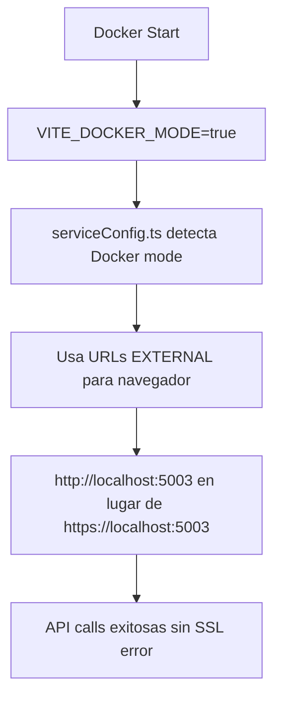

# 🔧 SSL Protocol Error - Solución Completa

## 📋 Problema Original
```
POST https://localhost:5003/api/customers/register net::ERR_SSL_PROTOCOL_ERROR
```

El frontend intentaba hacer llamadas HTTPS a servicios backend configurados solo para HTTP en Docker.

## 🎯 Solución Implementada

### 1. **Archivos Modificados**

#### ✅ `constants/api.ts`
**Problema**: URLs HTTPS hardcodeadas
```typescript
// ❌ ANTES (hardcodeado)
export const API_ENDPOINTS = {
  CUSTOMERS: {
    BASE: 'https://localhost:5003/api/customers',
    // ...
  }
};
```

**Solución**: URLs dinámicas desde serviceConfig
```typescript
// ✅ DESPUÉS (dinámico)
import { serviceConfig } from '../config/serviceConfig';

export const API_ENDPOINTS = {
  CUSTOMERS: {
    BASE: `${serviceConfig.customerService}/api/customers`,
    // ...
  }
};
```

#### ✅ `services/apiClient.ts`
**Problema**: Clientes API con URLs HTTPS hardcodeadas
```typescript
// ❌ ANTES (hardcodeado)
export const customerApiClient = createApiClient('https://localhost:5003');
export const orderApiClient = createApiClient('https://localhost:5001');
export const productApiClient = createApiClient('https://localhost:5002');
export const loggingApiClient = createApiClient('https://localhost:5004');
```

**Solución**: Clientes API con URLs dinámicas
```typescript
// ✅ DESPUÉS (dinámico)
import { serviceConfig } from '../config/serviceConfig';

export const customerApiClient = createApiClient(serviceConfig.customerService);
export const orderApiClient = createApiClient(serviceConfig.orderService);
export const productApiClient = createApiClient(serviceConfig.productService);
export const loggingApiClient = createApiClient(serviceConfig.loggingService);
```

#### ✅ `docker-compose.yml`
**Problema**: Frontend sin variable VITE_DOCKER_MODE
**Solución**: Agregada variable de entorno
```yaml
environment:
  - VITE_DOCKER_MODE=true  # ✅ Agregado
  # URLs externas para el navegador (localhost)
  - VITE_CUSTOMER_SERVICE_EXTERNAL_URL=http://localhost:5003
  # ... más URLs
```

### 2. **Flujo de Configuración Corregido**



### 3. **Variables de Entorno Docker**

```yaml
# En docker-compose.yml
environment:
  # Modo Docker activado
  - VITE_DOCKER_MODE=true
  
  # URLs externas para el navegador (localhost HTTP)
  - VITE_ORDER_SERVICE_EXTERNAL_URL=http://localhost:5001
  - VITE_PRODUCT_SERVICE_EXTERNAL_URL=http://localhost:5002
  - VITE_CUSTOMER_SERVICE_EXTERNAL_URL=http://localhost:5003
  - VITE_LOGGING_SERVICE_EXTERNAL_URL=http://localhost:5004
```

## 🔄 Proceso de Aplicación

1. **Detección del problema**: Error SSL en llamadas API desde frontend Docker
2. **Diagnóstico**: URLs HTTPS hardcodeadas en múltiples archivos
3. **Solución Fase 1**: Corregir `constants/api.ts`
4. **Solución Fase 2**: Corregir `services/apiClient.ts` 
5. **Configuración Docker**: Agregar `VITE_DOCKER_MODE=true`
6. **Restart**: Reiniciar frontend container para aplicar cambios

## ✅ Resultado Final

- ✅ Frontend detecta modo Docker automáticamente
- ✅ URLs API se configuran dinámicamente (HTTP en Docker, configurable en local)
- ✅ Sin errores SSL protocol
- ✅ Sistema completamente funcional en Docker
- ✅ Compatibilidad mantenida para desarrollo local

## 🧪 Verificación

```bash
# Verificar que no hay más URLs HTTPS hardcodeadas
grep -r "https://localhost" order-management-frontend/src/

# Verificar logs del frontend
docker-compose logs frontend

# Probar registro en la aplicación
# Ir a http://localhost:3000 y registrar usuario
```

## 📝 Comandos de Gestión

```bash
# Reiniciar solo frontend después de cambios de configuración
docker-compose restart frontend

# Ver logs en tiempo real
docker-compose logs -f frontend

# Verificar estado de todos los servicios
docker-compose ps
```

## 🎯 Lecciones Aprendidas

1. **Hardcoded URLs**: Evitar URLs hardcodeadas en aplicaciones multi-entorno
2. **Environment Detection**: Importancia de detectar correctamente el entorno de ejecución
3. **Docker Networking**: Diferencia entre URLs internas (container-to-container) y externas (browser-to-container)
4. **Configuration Layers**: Múltiples capas de configuración requieren revisión completa

---
**Estado**: ✅ SOLUCIONADO COMPLETAMENTE  
**Fecha**: 2025-08-03  
**Sistema**: Order Management System Docker
